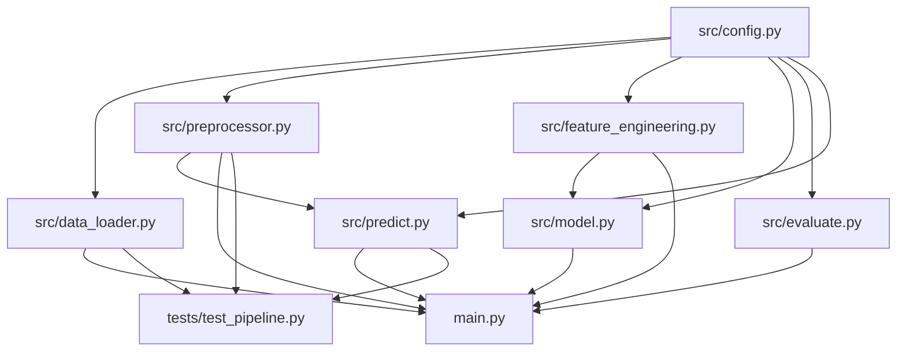

# Implementation Plan - Email Spam Detection ML System

This document outlines the design and implementation plan for building a production-grade, end-to-end Machine Learning pipeline for email spam detection.

## Project Goal
The goal of this project is to build a robust, production-grade Email Spam Detection Machine Learning system. The system will load raw email/message data from a CSV, preprocess and clean the text, engineer TF-IDF and Bag-of-Words features, train and evaluate multiple classifiers (Naïve Bayes, Logistic Regression, and Random Forest), save the best performing model, and provide interfaces for evaluation, prediction, and testing. It features structured logging, full config-driven configuration, and high code quality standard with Google-style docstrings and type hints.

## Folder Structure
We will create the project inside the subdirectory `C:/Users/DHRUVIL/.gemini/antigravity/scratch/email-spam-detection`.

```
email-spam-detection/
├── data/
│   └── spam.csv              ← (Already copied here)
├── notebooks/
│   └── 01_EDA.ipynb          ← Explanatory EDA notebook placeholder
├── src/
│   ├── __init__.py           ← Package initialization
│   ├── config.py             ← Dataclass configuration and paths
│   ├── data_loader.py        ← Loading and standardising raw data
│   ├── preprocessor.py       ← Text cleaning and stemming
│   ├── feature_engineering.py ← Vectorizers (TF-IDF, CountVectorizer)
│   ├── model.py              ← Model definition, training, and CV selection
│   ├── evaluate.py           ← Metrics reporting and visualization
│   └── predict.py            ← Prediction logic and confidence scoring
├── models/                   ← Saved model and vectorizer binaries
├── reports/                  ← Visualizations (Confusion Matrix, ROC Curve)
├── tests/
│   └── test_pipeline.py      ← pytest unit tests
├── main.py                   ← CLI entry point orchestrating training/eval/inference
├── requirements.txt          ← Python dependency definitions
└── README.md                 ← Project documentation
```

## Module Dependency Graph
The relationship and import order between modules:



## ML Pipeline Steps
The pipeline executes sequentially in the following order:
1. **Initialization**: Config dataclass resolves absolute directory paths. Logging writes timestamps to stdout and `logs/run.log`.
2. **Data Loading**: `src/data_loader.py` reads `data/spam.csv` handling encoding fallbacks (`utf-8` → `latin-1` → `cp1252`), filters out unnamed columns, and standardizes columns to `text` and `label`.
3. **Preprocessing**: Text is lowercased, stripped of HTML tags, URLs, punctuation, digits, and extra whitespaces. Stopwords are removed, and words are stemmed using NLTK PorterStemmer.
4. **Train-Test Split**: Cleaned dataset is split into training (80%) and testing (20%) partitions with stratification.
5. **Feature Extraction**: TF-IDF vectorizer (unigrams + bigrams, max 5000 features) is fit on the training text and transforms the datasets. Alternate CountVectorizer is also prepared. Vectorizer is saved to the `models/` directory.
6. **Model Selection (Cross-Val)**: A Scikit-learn Pipeline (vectorizer + model) is run using 5-fold cross-validation on MultinomialNB, LogisticRegression, and RandomForestClassifier.
7. **Model Saving**: The best model (highest F1-score) is fit on the complete training set and saved to `models/` using joblib.
8. **Evaluation**: Predictions are made on the test set. Reports (accuracy, precision, recall, F1, ROC-AUC) are saved, and plots (confusion matrix, ROC curve) are written to `reports/`.
9. **Inference**: Prediction module loads saved artifacts to classify new strings and return labels and confidence scores.

## Risk Items
1. **CSV Schema & Column Names**: In the inspected `spam.csv`, the text is under column `v2` and label under column `v1`, with several unnamed/empty trailing columns. `data_loader.py` must auto-detect columns by position (first two columns) and rename them to `label` and `text`, ignoring empty columns.
2. **Character Encoding**: The CSV contains non-ASCII characters (``). Reading with default `utf-8` will fail. We will implement fallback loading using `encoding='latin-1'` or `encoding='cp1252'` to handle this.
3. **NLTK Resource Downloading**: NLTK requires downloading of the `stopwords` and `wordnet` packages. The system must automatically download them if they are missing at runtime.
4. **Class Imbalance**: Spam datasets typically have heavy class imbalance (e.g. 85% ham, 15% spam). Evaluation should prioritize F1-score rather than accuracy, and splitting must use stratification (`stratify=y`).

## Proposed Changes
We will create all the files specified in the directory structure.

### [Component Name] - Core Pipeline

#### [NEW] [config.py](file:///C:/Users/DHRUVIL/.gemini/antigravity/scratch/email-spam-detection/src/config.py)
Configuration dataclass setting all parameters, random seed, and relative directory resolvers.

#### [NEW] [data_loader.py](file:///C:/Users/DHRUVIL/.gemini/antigravity/scratch/email-spam-detection/src/data_loader.py)
Presents loading logic with encoding validation and schema correction.

#### [NEW] [preprocessor.py](file:///C:/Users/DHRUVIL/.gemini/antigravity/scratch/email-spam-detection/src/preprocessor.py)
Text cleaning pipeline (regex cleaning, stopwords filtering, and stemming).

#### [NEW] [feature_engineering.py](file:///C:/Users/DHRUVIL/.gemini/antigravity/scratch/email-spam-detection/src/feature_engineering.py)
TF-IDF and CountVectorizer features generation and saving.

#### [NEW] [model.py](file:///C:/Users/DHRUVIL/.gemini/antigravity/scratch/email-spam-detection/src/model.py)
Defines MultinomialNB, LogisticRegression, and RandomForestClassifier. Performs 5-fold cross-validation and exports the best classifier.

#### [NEW] [evaluate.py](file:///C:/Users/DHRUVIL/.gemini/antigravity/scratch/email-spam-detection/src/evaluate.py)
Saves precision-recall reports and renders confusion matrix heatmaps and ROC curves.

#### [NEW] [predict.py](file:///C:/Users/DHRUVIL/.gemini/antigravity/scratch/email-spam-detection/src/predict.py)
Provides simple class/confidence inference.

#### [NEW] [main.py](file:///C:/Users/DHRUVIL/.gemini/antigravity/scratch/email-spam-detection/main.py)
Entry point supporting CLI commands `--train`, `--evaluate`, and `--predict`.

#### [NEW] [test_pipeline.py](file:///C:/Users/DHRUVIL/.gemini/antigravity/scratch/email-spam-detection/tests/test_pipeline.py)
pytest unit tests for pipeline parts.

## Verification Plan
1. **Training Phase**: Execute `python main.py --train` and confirm model files (`best_model.joblib`, `tfidf_vectorizer.joblib`) are generated.
2. **Evaluation Phase**: Execute `python main.py --evaluate` and confirm charts are created under `reports/`.
3. **Inference Phase**: Execute `python main.py --predict "You won a cash prize! Call now."` and ensure output format is JSON-like dictionary: `{"label": "Spam", "confidence": 0.95}`.
4. **Unit Tests**: Run `pytest tests/` to verify all components pass unit tests.
