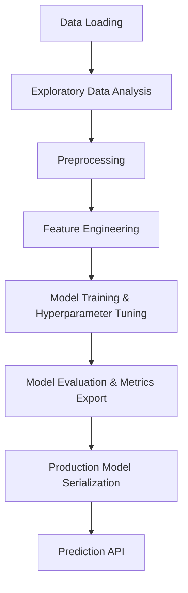
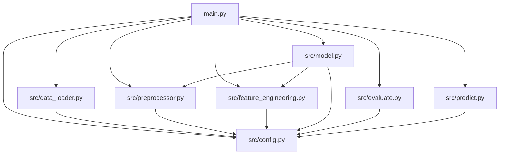

# Production-Grade Sales Prediction ML System - Implementation Plan

This implementation plan outlines the development of a production-grade machine learning system to predict sales based on advertising spends in different media channels (TV, Radio, Newspaper).

## Project Goal and Business Context

In advertising and marketing, companies allocate budgets across various media channels to drive sales. Understanding the relationship between advertising spend and sales is critical for optimizing budget allocation and maximizing ROI.
This system will load the advertising spend dataset, perform exploratory data analysis, preprocess and clean the data, engineer interaction and aggregated features, train and evaluate multiple regression models, and output a production-ready model artifact for real-time predictions.

## Folder Structure

Below is the planned ASCII folder structure for the workspace at `C:\Users\DHRUVIL\OneDrive\Documents\Oasis_InfoByte\OIBSIP\sales-prediction`:

```text
sales-prediction/
├── data/                          ← Dataset CSV will be moved here
│   └── Advertising.csv
├── notebooks/
│   └── 01_EDA.ipynb               ← Exploratory Data Analysis notebook
├── src/
│   ├── __init__.py
│   ├── config.py                  ← Constants, paths, hyperparameters
│   ├── data_loader.py             ← Data loading and verification
│   ├── preprocessor.py            ← Imputation, encoding, outlier capping
│   ├── feature_engineering.py     ← Scaling, interaction features, correlation filter
│   ├── model.py                   ← Model definition, training, CV, hyperparameter tuning
│   ├── evaluate.py                ← Evaluation metrics (MAE, RMSE, R2), plotting
│   └── predict.py                 ← Prediction API for loaded model and scaler
├── models/                        ← Trained model and scaler artifacts (joblib)
├── reports/                       ← Evaluation reports and metrics CSV
│   └── figures/                   ← Performance plots (Actual vs Predicted, residuals, etc.)
├── logs/                          ← Runtime logs directory
├── tests/
│   └── test_pipeline.py           ← pytest integration tests
├── main.py                        ← Entrypoint for train/evaluate/predict
├── requirements.txt               ← Python dependencies
├── README.md                      ← Project overview and documentation
└── RUNNING_GUIDE.md               ← Step-by-step setup and execution guide
```

## ML Pipeline Stages

The ML pipeline is structured sequentially as follows:



1. **Data Loading (`src/data_loader.py`)**:
   - Reads `Advertising.csv` from `data/`.
   - Auto-detects the target column (e.g. `Sales`).
   - Drops unnecessary index columns and normalizes column names.
   - Logs dataset characteristics (shape, data types, missing counts, basic stats).
2. **Exploratory Data Analysis (`notebooks/01_EDA.ipynb`)**:
   - Analyzes column distributions, correlations, outliers, and scatter/pairplots.
   - Saves figures and records findings.
3. **Preprocessing (`src/preprocessor.py`)**:
   - Missing value imputation: numeric features using the median, categorical features (if any) using the mode.
   - Categorical encoding: Label encoding or one-hot encoding depending on cardinality.
   - Outlier detection and capping using the Interquartile Range (IQR) method (capping values outside $[Q_1 - 1.5 \times IQR, Q_3 + 1.5 \times IQR]$).
4. **Feature Engineering (`src/feature_engineering.py`)**:
   - Interaction feature creation:
     - `TV_Radio_interaction` = `TV` $\times$ `Radio`
     - `total_ad_spend` = `TV` + `Radio` + `Newspaper`
   - Correlation analysis: drops any features with collinearity $> 0.95$ with each other to reduce multicollinearity.
   - Numerical Scaling: Fits and compares `StandardScaler` and `MinMaxScaler`, saving the chosen fitted scaler to `models/`.
5. **Model Training (`src/model.py`)**:
   - Trains 4 regressors using scikit-learn Pipelines:
     - Baseline: Linear Regression
     - Regularized: Ridge and Lasso Regression
     - Ensemble: Random Forest Regressor
     - Boosting: XGBoost Regressor
   - Evaluates performance using 5-fold cross-validation.
   - Conducts hyperparameter tuning using `GridSearchCV` for the top 2 models.
   - Saves the best-performing model (highest cross-validated $R^2$ score) to `models/`.
6. **Model Evaluation (`src/evaluate.py`)**:
   - Calculates metrics on the hold-out test set: MAE, MSE, RMSE, $R^2$, and Adjusted $R^2$.
   - Exports figures to `reports/figures/`:
     - Actual vs Predicted Scatter Plot
     - Residual Plot
     - Feature Importance Bar Chart
     - Learning Curve
   - Exports metrics summary to `reports/model_metrics.csv`.
7. **Prediction (`src/predict.py`)**:
   - Exposes `predict(input_data: dict)` interface which validates inputs, applies pre-processing/scaling, and returns the prediction.

## Module Dependency Map



## Assumptions about CSV Schema

- The dataset file is named `Advertising.csv` and is located in the workspace directory.
- The columns are:
  - An index column (which will be dropped).
  - `TV`: Ad spend on TV (numeric).
  - `Radio`: Ad spend on Radio (numeric).
  - `Newspaper`: Ad spend on Newspaper (numeric).
  - `Sales`: Target variable representing sales units (numeric).
- The target column can be identified by case-insensitive matching of "Sales", "sales", "Revenue", "revenue", or "target".

## User Review Required

> [!IMPORTANT]
> The source dataset `Advertising.csv` is currently in the root workspace directory. I will create a `data/` directory and move the file into `data/Advertising.csv` during the execution phase to match the requested clean folder structure.

> [!NOTE]
> Since this dataset is purely numeric (`TV`, `Radio`, `Newspaper`, `Sales`), some preprocessing features like categorical encoding will not be heavily exercised, but the `preprocessor.py` will still implement robust categorical handling routines to support generalizability and follow instructions exactly.

## Verification Plan

### Automated Tests
We will write tests in `tests/test_pipeline.py` using `pytest`. The verification commands are:
- Check test execution:
  ```powershell
  pytest tests/
  ```

### Manual Verification
1. Run training:
   ```powershell
   python main.py --train
   ```
   *Expected outcome*: Model fits successfully, console/file logging occurs, model files are saved to `models/`.
2. Run evaluation:
   ```powershell
   python main.py --evaluate
   ```
   *Expected outcome*: Evaluation plots generated in `reports/figures/` and metrics CSV written to `reports/model_metrics.csv`.
3. Run predictions:
   ```powershell
   python main.py --predict '{"TV": 230.1, "Radio": 37.8, "Newspaper": 69.2}'
   ```
   *Expected outcome*: Predication dict returned with predicted sales amount and model description.
